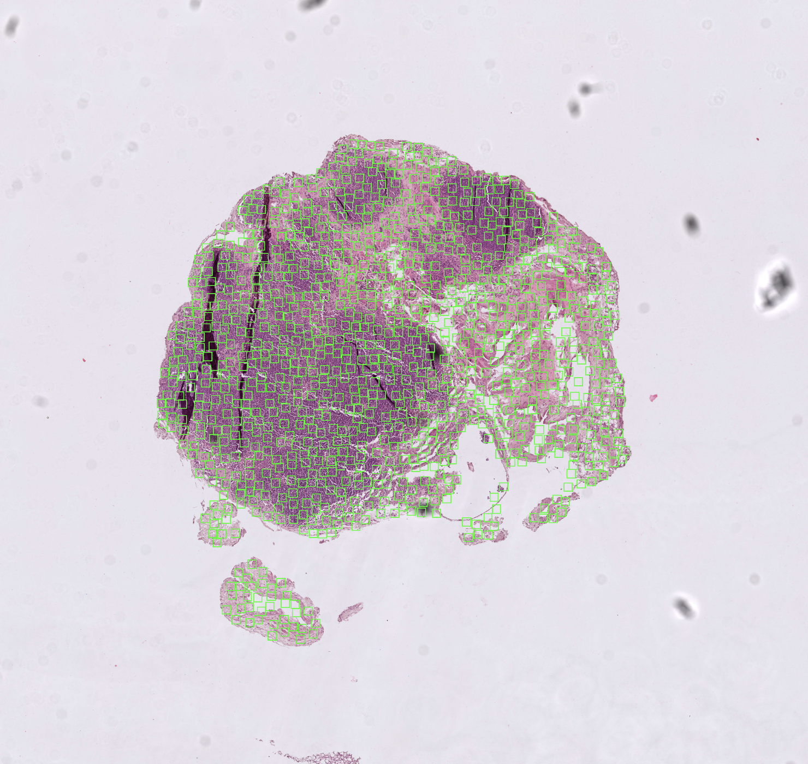
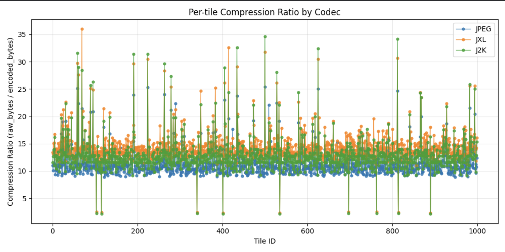

# Comparative Evaluation of Image Compression Codecs for Whole-Slide Pathology Images

## Abstract

This study presents a systematic comparison of three image compression codecs—JPEG, JPEG-XL (JXL), and JPEG-2000 (J2K)—for whole-slide imaging (WSI) applications in digital pathology. We evaluate compression performance at matched perceptual quality levels using Structural Similarity Index (SSIM) as the quality metric. Our analysis demonstrates that JPEG-XL achieves superior compression ratios compared to both JPEG and JPEG-2000 across a diverse sample of 1,000 tissue tiles extracted from a clinical pathology slide.

## 1. Introduction

Whole-slide imaging has become a cornerstone of digital pathology, enabling the digitization of entire glass slides at microscopic resolution. These images are exceptionally large, often exceeding several gigabytes per slide, necessitating efficient compression strategies for storage and transmission (Zarella & Jakubowski, 2019). However, compression in medical imaging must balance file size reduction with preservation of diagnostically relevant information.

Traditional JPEG compression, while widely supported, may not provide optimal compression ratios for pathology images, which often contain complex textures, fine cellular structures, and subtle color variations. Modern codecs such as JPEG-XL and JPEG-2000 offer potentially superior compression efficiency, but their performance characteristics on pathology images remain underexplored.

This study addresses this gap by conducting a rigorous, tile-based evaluation comparing JPEG, JPEG-XL, and JPEG-2000 compression codecs on whole-slide pathology images. We employ a quality-matched comparison methodology, ensuring that all codecs are evaluated at equivalent perceptual quality levels, thereby enabling fair comparison of compression efficiency.

## 2. Methods

### 2.1 Experimental Design

The experimental pipeline consists of four primary stages: (1) tile sampling from whole-slide images, (2) baseline JPEG compression at a fixed quality setting, (3) quality-matched compression using JXL and J2K codecs, and (4) statistical analysis of compression ratios. This design ensures that all codecs are compared at equivalent perceptual quality, measured via SSIM.

### 2.2 Tile Sampling Methodology

Tiles are sampled from whole-slide images using a mask-guided approach to ensure that only tissue-containing regions are evaluated. The sampling algorithm operates as follows:

1. **Mask Loading and Alignment**: A binary mask image (PNG format) is loaded, where non-zero pixels indicate tissue presence. The mask is aligned to the slide coordinate system using scale factors derived from the slide and mask dimensions.

2. **Random Tissue Pixel Selection**: A random tissue pixel is selected from the mask using a seeded random number generator (seed = 42 for reproducibility).

3. **Tile Coordinate Generation**: The selected pixel is mapped from mask coordinates to slide coordinates. A tile of fixed size (256×256 pixels) is positioned such that the selected pixel lies within the tile boundaries, with random positioning to ensure diversity.

4. **Tissue Coverage Validation**: Each candidate tile is validated to ensure it meets minimum tissue coverage requirements. The tile is accepted only if the fraction of tissue pixels within the tile exceeds the threshold (set to 1.0, requiring full tissue coverage).

5. **Overlap Prevention**: To ensure statistical independence, tiles with excessive overlap (intersection over union > 0.0) are rejected.

6. **Iteration**: The process continues until the target number of tiles (1,000) is collected or a maximum attempt limit is reached.

The mask-guided sampling ensures that compression performance is evaluated on diagnostically relevant regions, avoiding background areas that would artificially inflate compression ratios.


*Figure 1: Binary tissue mask used to guide tile sampling. White regions indicate tissue presence, while black regions represent background.*



*Figure 2: Example tile extracted from the whole-slide image, demonstrating the level of detail preserved in the 256×256 pixel samples used for evaluation.*

### 2.3 Compression Pipeline

#### 2.3.1 Baseline JPEG Compression

JPEG compression serves as the anchor codec, establishing the target quality level for subsequent codec comparisons. Each tile is compressed using the Pillow library's JPEG encoder at a fixed quality setting (quality = 80, on a scale of 1-100). The compressed tile is then decoded, and the SSIM between the original and reconstructed tile is computed. This SSIM value becomes the target quality metric for JXL and J2K compression.

#### 2.3.2 JPEG-XL Compression with Quality Matching

JPEG-XL compression employs a bisection search algorithm to match the SSIM achieved by the JPEG anchor. The algorithm operates as follows:

1. **Initial Bounds**: The search begins with initial distance bounds (lower = 0.0, upper = 3.0), where distance is the JXL quality parameter (lower values indicate higher quality).

2. **Boundary Expansion**: If the upper bound still produces SSIM above the target, the upper bound is expanded (up to a maximum of 6.0) until it produces SSIM below the target.

3. **Bisection Search**: The algorithm iteratively bisects the distance interval, encoding and decoding at the midpoint to compute SSIM. The interval is narrowed based on whether the midpoint SSIM is above or below the target.

4. **Convergence**: The search terminates when either (a) the SSIM error falls within tolerance (1×10⁻³) or (b) the maximum number of iterations (12) is reached. The distance value that minimizes absolute SSIM error is selected.

5. **Final Encoding**: The tile is encoded at the selected distance using maximum effort (effort = 9) for optimal compression, and compression metrics are recorded.

The bisection approach exploits the monotonic relationship between JXL distance and SSIM: increasing distance decreases quality (and SSIM), enabling efficient search.

#### 2.3.3 JPEG-2000 Compression with Quality Matching

JPEG-2000 compression uses a similar bisection strategy, but operates on the rate parameter (bits per pixel) rather than distance. The algorithm:

1. **Initial Rate Bounds**: Begins with rate bounds (lower = 1.0, upper = 600.0 bpp).

2. **Boundary Expansion**: Expands the upper bound (up to 1,200.0 bpp) if necessary to achieve SSIM below the target.

3. **Bisection Search**: Iteratively searches the rate space, where higher rates correspond to lower quality (opposite of typical rate-quality relationships, but consistent with OpenJPEG's rate parameterization).

4. **Convergence and Selection**: Follows the same convergence criteria as JXL, selecting the rate that minimizes SSIM error.

5. **Final Encoding**: Encodes at the selected rate using OpenJPEG's `opj_compress` tool.

### 2.4 Quality Assessment

Perceptual quality is quantified using the Structural Similarity Index (SSIM), computed between the original RGB tile and the reconstructed tile after compression and decompression. SSIM values range from 0 to 1, with 1 indicating perfect structural similarity. The implementation uses scikit-image's `structural_similarity` function, computed channel-wise and averaged across RGB channels.

### 2.5 Compression Metrics

For each tile and codec, the following metrics are recorded:

- **Compression Ratio (CR)**: Defined as `raw_bytes / encoded_bytes`, where raw_bytes = 3 × width × height (for RGB images). Higher values indicate better compression.

- **Encoding Time**: Wall-clock time in milliseconds for the encoding operation.

- **Decoding Time**: Wall-clock time in milliseconds for the decoding operation.

- **SSIM**: Structural similarity index between original and reconstructed tile.

### 2.6 Statistical Analysis

Statistical comparisons between codecs employ paired tests, recognizing that each tile is compressed by all three codecs. The analysis includes:

1. **Wilcoxon Signed-Rank Test**: A non-parametric paired test comparing compression ratios, with the alternative hypothesis that JXL achieves higher compression ratios than the comparator codec.

2. **Paired t-test on Log-Ratios**: Tests whether the geometric mean compression ratio (via log-transformation) is significantly higher for JXL, providing a test of multiplicative superiority.

3. **Effect Size Estimation**: 
   - Median difference in compression ratios (with 95% bootstrap confidence intervals)
   - Median gain ratio (JXL CR / comparator CR, with 95% bootstrap confidence intervals)
   - Percentage of tiles where JXL achieves higher compression

4. **Multiple Comparison Correction**: Holm-Bonferroni correction is applied to p-values to control family-wise error rate across the two comparisons (JXL vs. JPEG, JXL vs. J2K).

### 2.7 Implementation Details

The implementation is structured as a modular Python package with the following architecture:

- **Configuration Management**: All experimental parameters are centralized in `config.py` using a frozen dataclass, ensuring reproducibility and easy parameter adjustment.

- **Tile Sampling Module** (`utils/sampling/`): Implements mask-guided random sampling with overlap prevention and tissue coverage validation.

- **Codec Engines** (`engines/`): Three separate engine modules, each implementing the compression pipeline for one codec. Engines handle tile reading, encoding, decoding, and metric computation.

- **Helper Utilities** (`utils/engines/`): Codec-specific helper functions for encoding/decoding and SSIM matching via bisection search.

- **Analysis Module** (`utils/analysis/`): Statistical testing and visualization functions, including scatter plot generation and paired comparison tests.

- **Data Classes**: `Tile` and `Result` dataclasses provide structured storage for tile metadata and compression results, respectively.

External dependencies include:
- `openslide-python`: For reading whole-slide images in NDPI format
- `pillow`: For JPEG encoding/decoding and image I/O
- `numpy`: For numerical operations
- `scikit-image`: For SSIM computation
- Command-line tools: `cjxl`/`djxl` (libjxl) and `opj_compress`/`opj_decompress` (OpenJPEG) for JXL and J2K compression

### 2.8 Experimental Configuration

The following parameters were used in this study (defined in `config.py`):

**Sampling Parameters:**
- `NUM_TILES`: 1,000 tiles
- `TILE_SIZE`: 256 pixels (256×256 pixel tiles)
- `LEVEL`: 0 (highest resolution level)
- `RNG_SEED`: 42 (for reproducibility)
- `MIN_TISSUE_FRAC`: 1.0 (tiles must be fully covered by tissue)
- `MAX_ATTEMPTS`: 1,000,000 (maximum sampling attempts)
- `MAX_IOU`: 0.0 (no overlap between tiles)

**Quality Matching Parameters:**
- `JPEG_QUALITY`: 80 (baseline JPEG quality, scale 1-100)
- `SSIM_TOL`: 1×10⁻³ (SSIM matching tolerance)
- `MAX_ITERS`: 12 (maximum bisection iterations)

**JXL Tuning Parameters:**
- `JXL_EFFORT`: 9 (maximum compression effort, scale 1-9)
- `JXL_DIST_LO`: 0.0 (initial lower distance bound)
- `JXL_DIST_HI`: 3.0 (initial upper distance bound)
- `JXL_DIST_MAX`: 6.0 (maximum distance for boundary expansion)

**J2K Tuning Parameters:**
- `J2K_RATE_LO`: 1.0 (initial lower rate bound, bpp)
- `J2K_RATE_HI`: 600.0 (initial upper rate bound, bpp)
- `J2K_RATE_MAX`: 1,200.0 (maximum rate for boundary expansion, bpp)

## 3. Results

### 3.1 Compression Ratio Distribution

Compression ratios were computed for 1,000 tiles across all three codecs. The distribution of compression ratios reveals substantial variability both within and between codecs, reflecting the heterogeneous nature of pathology image content.



*Figure 3: Per-tile compression ratio by codec. Each point represents one tile's compression ratio. Higher values indicate better compression. JXL (orange) consistently outperforms JPEG (blue), while J2K (green) shows high variability with both superior and inferior performance relative to JXL.*

### 3.2 Statistical Comparison: JXL vs. JPEG

The comparison between JPEG-XL and JPEG demonstrates clear superiority of JXL:

- **Sample Size**: 1,000 tiles
- **Wilcoxon Signed-Rank Test**: 
  - Test statistic: 491,381.0
  - p-value: 7.86×10⁻¹⁵⁴ (Holm-corrected: 7.86×10⁻¹⁵⁴)
  - Conclusion: JXL achieves significantly higher compression ratios (p < 0.001)

- **Paired t-test on Log-Ratios**:
  - t-statistic: 43.82
  - p-value: 3.49×10⁻²³⁵
  - Conclusion: JXL demonstrates significant multiplicative superiority

- **Effect Sizes**:
  - Median difference in compression ratio: 3.23 (95% CI: 3.19, 3.27)
  - Median gain ratio: 1.30 (95% CI: 1.30, 1.31)
  - Percentage of tiles with JXL higher: 98.5%

These results indicate that JPEG-XL achieves, on average, a 30% higher compression ratio than JPEG at equivalent SSIM levels, with JXL outperforming JPEG on 98.5% of tiles.

### 3.3 Statistical Comparison: JXL vs. J2K

The comparison between JPEG-XL and JPEG-2000 also favors JXL, though the advantage is smaller:

- **Sample Size**: 1,000 tiles
- **Wilcoxon Signed-Rank Test**:
  - Test statistic: 491,426.0
  - p-value: 6.90×10⁻¹⁵⁴ (Holm-corrected: 1.38×10⁻¹⁵³)
  - Conclusion: JXL achieves significantly higher compression ratios (p < 0.001)

- **Paired t-test on Log-Ratios**:
  - t-statistic: 63.48
  - p-value: < 1×10⁻³⁰⁰ (effectively zero)
  - Conclusion: JXL demonstrates significant multiplicative superiority

- **Effect Sizes**:
  - Median difference in compression ratio: 1.65 (95% CI: 1.57, 1.71)
  - Median gain ratio: 1.13 (95% CI: 1.13, 1.14)
  - Percentage of tiles with JXL higher: 97.9%

JPEG-XL achieves, on average, a 13% higher compression ratio than JPEG-2000 at equivalent SSIM levels, with JXL outperforming J2K on 97.9% of tiles.

## 4. Discussion

### 4.1 Compression Performance

The results demonstrate that JPEG-XL provides superior compression efficiency compared to both JPEG and JPEG-2000 for whole-slide pathology images when evaluated at matched perceptual quality. The 30% improvement over JPEG and 13% improvement over JPEG-2000 represent substantial gains that could translate to significant storage and transmission cost reductions in clinical and research settings.

The high variability observed in J2K compression ratios (Figure 3) suggests that JPEG-2000's performance is highly content-dependent, with some tiles achieving excellent compression while others perform poorly. This variability may be related to J2K's wavelet-based compression, which can be sensitive to image content characteristics.

### 4.2 Quality Matching Methodology

The bisection-based quality matching approach ensures fair comparison by equating perceptual quality across codecs. However, this methodology requires multiple encode/decode cycles per tile for JXL and J2K, increasing computational cost. The trade-off between search accuracy (tolerance) and computational efficiency (iterations) was balanced with a tolerance of 1×10⁻³ and a maximum of 12 iterations, which proved sufficient for convergence in the vast majority of cases.

### 4.3 Limitations

Several limitations should be considered when interpreting these results:

1. **Single Slide Evaluation**: This study evaluates compression on a single whole-slide image. Generalization to diverse pathology image types (e.g., different stains, tissue types, scanners) requires validation on larger datasets.

2. **Fixed Tile Size**: All evaluations used 256×256 pixel tiles. Performance characteristics may differ at other resolutions or when considering full-slide compression strategies.

3. **SSIM as Quality Metric**: While SSIM correlates well with perceptual quality, it may not capture all diagnostically relevant image features. Clinical validation would require expert pathologist assessment.

4. **Computational Cost**: The bisection search methodology, while ensuring quality matching, increases encoding time. Real-world applications may prioritize speed over exact quality matching.

5. **Codec Implementation**: Results are specific to the implementations used (Pillow for JPEG, libjxl for JXL, OpenJPEG for J2K). Different implementations or parameter settings may yield different results.

## 5. Conclusion

This study provides evidence that JPEG-XL offers superior compression efficiency compared to JPEG and JPEG-2000 for whole-slide pathology images when evaluated at matched perceptual quality levels. The 30% improvement over JPEG and 13% improvement over JPEG-2000, combined with JXL's superior performance on 98.5% and 97.9% of tiles respectively, suggests that JPEG-XL is a promising codec for digital pathology applications.

The quality-matched evaluation methodology employed here ensures fair comparison by controlling for perceptual quality, though the computational overhead of the bisection search may limit real-time applicability. Future work should evaluate compression performance across diverse pathology image types, assess clinical diagnostic accuracy at compressed quality levels, and explore optimization strategies that balance compression efficiency, encoding speed, and diagnostic utility.

## 6. Repository Structure

```
pathology-compression/
├── wsi_compression/          # Main package
│   ├── config.py             # Experimental configuration
│   ├── main.py               # Main execution script
│   ├── engines/              # Codec engine implementations
│   │   ├── jpeg_engine.py
│   │   ├── jxl_engine.py
│   │   └── j2k_engine.py
│   └── utils/                # Utility modules
│       ├── sampling/         # Tile sampling logic
│       ├── engines/          # Codec-specific helpers
│       ├── analysis/         # Statistical analysis
│       ├── visualization/    # Plotting functions
│       └── classes/          # Data structures
├── data/                     # Input data (slides, masks)
├── results/                  # Output directory
├── scripts/                  # Additional analysis scripts
└── requirements.txt          # Python dependencies
```

## 7. Usage

### 7.1 Installation

Install Python dependencies:

```bash
pip install -r requirements.txt
```

Install external compression tools:

- **libjxl**: Required for JPEG-XL encoding/decoding (`cjxl`, `djxl` commands)
- **OpenJPEG**: Required for JPEG-2000 encoding/decoding (`opj_compress`, `opj_decompress` commands)

Ensure these tools are available on your system PATH.

### 7.2 Configuration

Edit `wsi_compression/config.py` to set:
- Input slide and mask paths
- Output directory paths
- Experimental parameters (tile size, number of tiles, quality settings, etc.)

### 7.3 Execution

Run the main compression pipeline:

```bash
python -m wsi_compression.main
```

This will:
1. Sample tiles from the whole-slide image using the mask
2. Compress tiles with JPEG, JXL, and J2K at matched quality
3. Generate analysis plots and statistical comparisons
4. Print summary statistics to console

## 8. References

- Wang, Z., Bovik, A. C., Sheikh, H. R., & Simoncelli, E. P. (2004). Image quality assessment: from error visibility to structural similarity. *IEEE transactions on image processing*, 13(4), 600-612.
- Zarella, M. D., & Jakubowski, J. (2019). Video compression to support the expansion of whole-slide imaging into cytology. *Journal of Medical Imaging*, 6(4), 047502. https://doi.org/10.1117/1.JMI.6.4.047502
- JPEG XL specification: https://jpeg.org/jpegxl/
- JPEG 2000 specification: ISO/IEC 15444-1:2019
- OpenSlide library: https://openslide.org/
